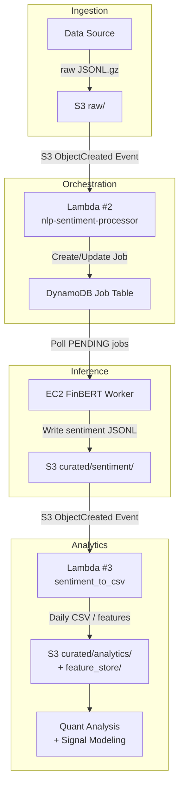

# nlp-trading-platform
An event-driven AWS pipeline for financial news sentiment analysis using FinBERT. Ingests raw text from S3, orchestrates jobs with Lambda and DynamoDB, runs inference on EC2, and outputs structured sentiment data for quantitative trading research.



## Repository structure

- **Lambda functions (serverless orchestration)**  
  → [lambda/README.md](lambda/README.md)

- **EC2 FinBERT worker (ML inference)**  
  → [worker/README.md](worker/README.md)

- **Infrastructure & setup notes**  
  → `infra/`

- **Example input/output samples**  
  → `example_data/`

- **Architecture diagrams & screenshots**  
  → `docs/`

## Repository Structure

- **Lambda functions**  
  → [lambda/README.md](lambda/README.md)

- **EC2 inference worker**  
  → [worker/README.md](worker/README.md)

- **Infrastructure & setup notes**  
  → `infra/`

- **Example input/output samples**  
  → `example_data/`

- **Screenshots & diagrams**  
  → `docs/`

---

## Core Components

### Lambda Layer (Serverless Orchestration)

- Handles event-driven triggers (S3, Kinesis)
- Creates and tracks jobs in DynamoDB
- Aggregates sentiment outputs into daily CSV features

➡️ **Details:** [lambda/README.md](lambda/README.md)

---

### EC2 FinBERT Worker (ML Inference)

- Polls DynamoDB for pending jobs
- Downloads raw inputs from S3
- Runs FinBERT sentiment inference
- Uploads JSONL outputs to S3 and updates job statuses

➡️ **Details:** [worker/README.md](worker/README.md)

---

## Outputs

### Sentiment JSONL (example)

```json
{"symbol":"AAPL","headline":"Apple stock rises after strong iPhone sales","sentiment_label":"positive"}
{"symbol":"TSLA","headline":"Tesla faces new regulatory challenges","sentiment_label":"negative"}
