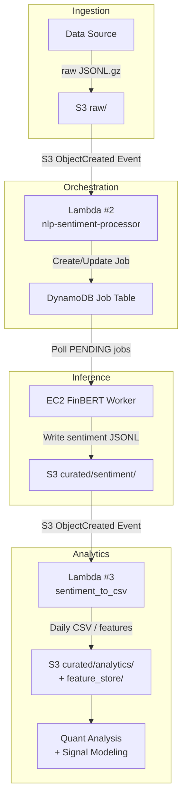

# nlp-trading-platform
An event-driven AWS pipeline for financial news sentiment analysis using FinBERT. Ingests raw text from S3, orchestrates jobs with Lambda and DynamoDB, runs inference on EC2, and outputs structured sentiment data for quantitative trading research.


## Repository Structure

- **Lambda functions**  
  → [lambda/README.md](lambda/README.md)

- **EC2 inference worker**  
  → [worker/README.md](worker/README.md)


---

## Core Components

### Lambda Layer (Serverless Orchestration)

- Handles event-driven triggers (S3, Kinesis)
- Creates and tracks jobs in DynamoDB
- Aggregates sentiment outputs into daily CSV features

➡️ **Details:** [lambda/README.md](lambda/README.md)

---

### EC2 FinBERT Worker (ML Inference)

- Polls DynamoDB for pending jobs
- Downloads raw inputs from S3
- Runs FinBERT sentiment inference
- Uploads JSONL outputs to S3 and updates job statuses

➡️ **Details:** [worker/README.md](worker/README.md)

---
## End-to-End Example

This section demonstrates a minimal, reproducible example of how the pipeline transforms raw financial text into aggregated sentiment features.

### Example Input (Raw News Headlines)

```json
{"symbol":"AAPL","headline":"Apple faces major lawsuit over alleged accounting fraud and revenue misreporting"}
{"symbol":"AMZN","headline":"Amazon reports record-breaking quarterly earnings and strong cloud growth"}
{"symbol":"MSFT","headline":"Microsoft hit with massive antitrust fine following regulatory investigation"}
{"symbol":"TSLA","headline":"Tesla announces schedule for upcoming investor presentation"}
```

### Sentiment Inference (FinBERT Output)

```json
{"symbol":"AAPL","headline":"Apple faces major lawsuit over alleged accounting fraud and revenue misreporting","sentiment_label":{"label":"negative","probs":[0.00000006,0.99999976,0.00000015]}}
{"symbol":"AMZN","headline":"Amazon reports record-breaking quarterly earnings and strong cloud growth","sentiment_label":{"label":"positive","probs":[0.96485305,0.03508006,0.00006691]}}
{"symbol":"MSFT","headline":"Microsoft hit with massive antitrust fine following regulatory investigation","sentiment_label":{"label":"negative","probs":[0.00000000,1.00000000,0.00000001]}}
{"symbol":"TSLA","headline":"Tesla announces schedule for upcoming investor presentation","sentiment_label":{"label":"neutral","probs":[0.00060776,0.00019650,0.99919575]}}
```

### Daily Aggregation Output

```csv
symbol,avg_sentiment_score,avg_positive,avg_negative,avg_neutral,positive_count,negative_count,neutral_count,total,date
AAPL,-0.9999997,0.00000006,0.99999976,0.00000015,0,1,0,1,2025-11-11
AMZN,0.9297730,0.96485305,0.03508006,0.00006691,1,0,0,1,2025-11-11
MSFT,-0.99999999,0.00000000,1.00000000,0.00000001,0,1,0,1,2025-11-11
TSLA,0.00041126,0.00060776,0.00019650,0.99919575,0,0,1,1,2025-11-11
```

**Note:** Example input data is synthetically created to demonstrate schema, reproducibility, and end-to-end pipeline behavior.

---

## IAM and Security

All components run with IAM roles following the principle of least privilege.

* Lambda functions have scoped access to S3 and DynamoDB
* The EC2 worker uses an instance role for S3 and DynamoDB access
* No static AWS credentials are stored in code

---

## Monitoring and Observability

* AWS Lambda and EC2 worker logs are emitted to CloudWatch
* Logs are used to verify job creation, inference progress, and failure handling
* Operational debugging is possible without direct instance access

---

## Tech Stack

* AWS: S3, Lambda, DynamoDB, EC2, Kinesis, CloudWatch, IAM
* NLP: FinBERT (Transformers / PyTorch)
* Language: Python

---

## Author

Yoon Cho